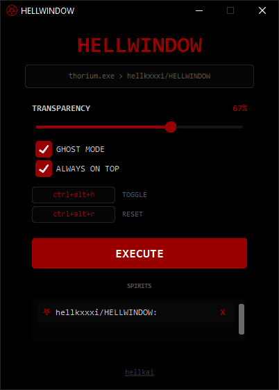

<h1 align="center">⛧ HELLWINDOW ⛧</h1>

<p align="center">
  A brutalist, AMOLED-style Windows utility for advanced window management. Inspired by tools like WindowTop, but focused on speed, minimalism, and a dark aesthetic.
</p>

<p align="center">
  
</p>

  Disclaimer: This tool is intended for personal productivity. Use it wisely.  
  
  

## ⚡ Features

- **Ghost Mode**: Make any window non-clickable (click-through). Perfect for tracing or keeping a reference visible while you work.
- **Transparency Control**: Smoothly adjust any window's opacity from 10% to 100%.
- **Always on Top**: Pin any window above all others with a single hotkey.
- **Spirit List**: Manage all transformed windows in a compact, ritualistic UI.
- **Hotkey Recording**: Rebind your keys on the fly by simply clicking the hotkey button.
- **Stealth Design**: Pure AMOLED black and deep blood-red UI.
- **Auto-Save**: All your preferences and keybindings are saved to `config.json`.

## 🛠 Installation

1. Clone the repository:
```bash
git clone https://github.com/hellkxxxi/HELLWINDOW.git
```
Install dependencies:

```bash
pip install -r requirements.txt
```
Run the application (Administrator rights are required to manage other windows):

```bash
python hellwindow.py
```
## ⌨️ Default Hotkeys
- `Ctrl+Alt+H`: Capture/Release active window.
- `Ctrl+Alt+H`: Banish all spirits (reset all windows).

## 📦 Building EXE
To build a standalone portable executable:
1. Install PyInstaller:

```bash
pip install pyinstaller
```

2. Run the build script:

```bash
 pyinstaller --noconsole --onefile --uac-admin --collect-all customtkinter --icon=icon.ico --add-data "icon.png;." --name HELLWINDOW hellwindow.py
 ```


## 🩸 Author
Created by **hellkai**